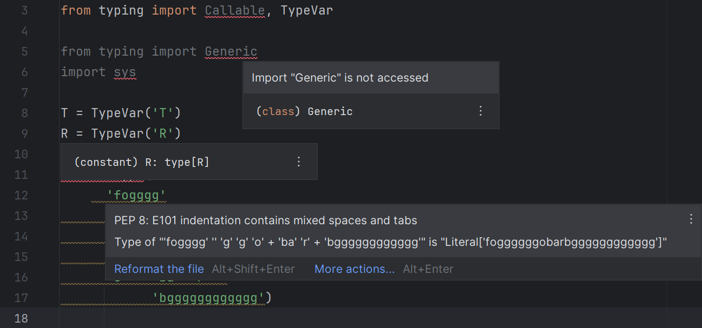

# Pyright Language Server for PyCharm Professional

<!-- Plugin description -->
Pyright language server integration for PyCharm Professional.

This plugin communicates with [the Pyright language server][1]
using [the experimental LSP API][2] added in PyCharm Professional 2023.2
to give you annotations about your code as you edit your Python files.

  [1]: https://github.com/microsoft/pyright
  [2]: https://plugins.jetbrains.com/docs/intellij/language-server-protocol.html
<!-- Plugin description end -->

This is a proof of concept. It may or may not work.
See existing issues for more information on the progress.

## Installation

This plugin has not been published to [the Marketplace][3].
Download the ZIP file(s) manually from [the <i>Releases</i> tab][4]
or [the <i>Actions</i> tab][5] and follow the instructions described [here][6].

## Usage

Go to <b>Settings</b> | <b>Tools</b> |
<b>Pyright LS (Global)</b> / <b>Pyright LS (Project)</b> and
set the path to your Pyright language server executable.
It is typically named `pyright-langserver`/`pyright-python-langserver`.
See [this page][7] for more information on what file to choose.

You might need to reopen your files or restart the IDE
for the files to be recognized by the language server.

## Credits

Most of the code is derived from [@koxudaxi/ruff-pycharm-plugin][8].
It is such a fortune that that plugin does almost the same thing
and is also written in Kotlin, and hence easily understandable.

The SVG and PNG logos are derived from [the README image][9]
of the [@microsoft/pyright][1] repository,
generated using Inkscape's autotrace feature.

## See also

* [Pyright for PyCharm][10], its sister plugin for PyCharm Community
  that makes use of Pyright's command-line interface.

  [3]: https://plugins.jetbrains.com/
  [4]: https://github.com/InSyncWithFoo/pyright-langserver-for-pycharm/releases
  [5]: https://github.com/InSyncWithFoo/pyright-langserver-for-pycharm/actions/workflows/build.yaml
  [6]: https://www.jetbrains.com/help/pycharm/managing-plugins.html#install_plugin_from_disk
  [7]: https://insyncwithfoo.github.io/pyright-for-pycharm/faq/#whats-the-difference-between-pyright-and-pyright-python
  [8]: https://github.com/koxudaxi/ruff-pycharm-plugin
  [9]: https://github.com/microsoft/pyright/blob/main/docs/img/PyrightLarge.png
  [10]: https://github.com/InSyncWithFoo/pyright-for-pycharm
